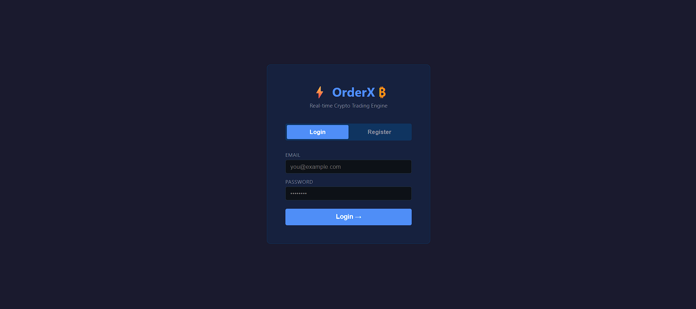
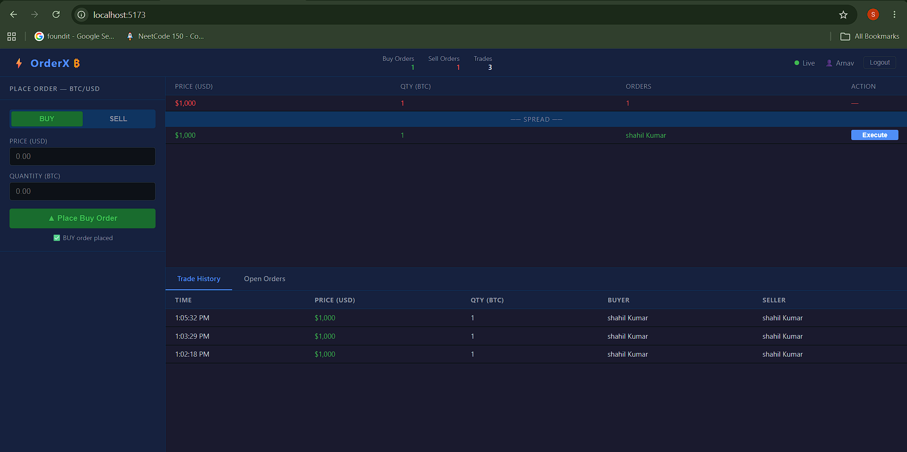
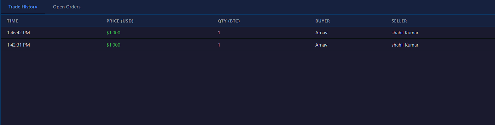

# ⚡ OrderX ₿ — Real-time Crypto Trading Engine

A full-stack real-time cryptocurrency trading engine built with the MERN stack.

  

## 🚀 Features

- 📊 **Real-time Order Book** — live updates via WebSocket (Socket.IO)
- ⚡ **O(1) Order Matching** — custom Map + Queue data structures
- 🔐 **JWT Authentication** — register/login with hashed passwords
- 💹 **Trade Execution** — match buyers with sellers instantly
- 📋 **Trade History** — persistent storage via MongoDB
- 🎨 **Zerodha-inspired UI** — dark theme, professional trading interface

## 🛠️ Tech Stack

| Layer | Technology |
|---|---|
| Frontend | React, Vite, Socket.IO Client |
| Backend | Node.js, Express.js |
| Database | MongoDB, Mongoose |
| Realtime | Socket.IO WebSocket |
| Auth | JWT, bcryptjs |
| DSA | Custom Map + Queue (Order Book) |

## 📦 Installation

### Prerequisites
- Node.js v22+
- MongoDB

### Setup

```bash
# Clone the repo
git clone https://github.com/ShahilKumar1107/orderx-trading-engine.git
cd orderx-trading-engine

# Setup server
cd server
npm install
# Create .env file with:
# PORT=5000
# MONGO_URI=mongodb://localhost:27017/orderx
# JWT_SECRET=your_secret_key
node index.js

# Setup client (new terminal)
cd client
npm install
npm run dev
```

## 🏗️ Architecture

## 📱 Screenshots

### Login Page


### Trading Interface


### Trade History
